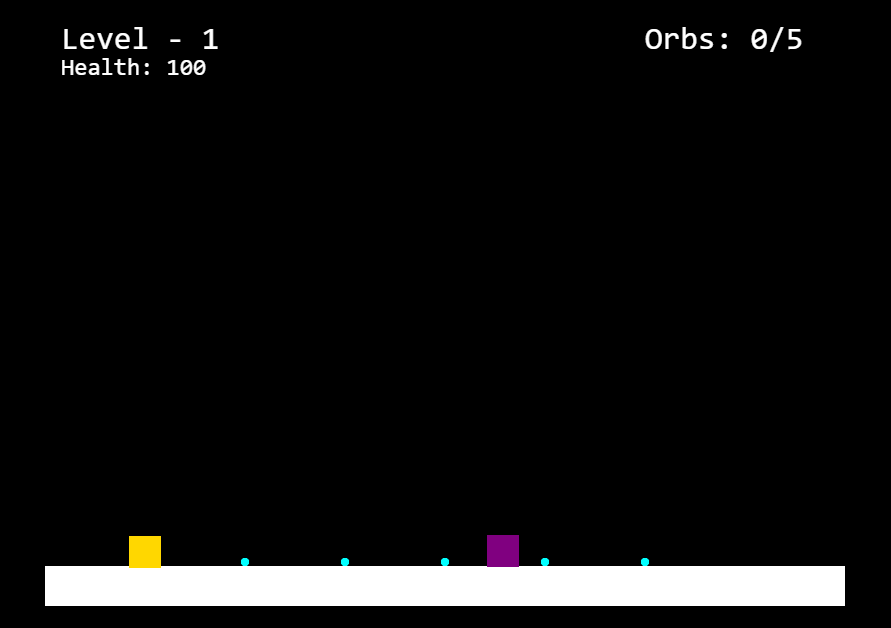
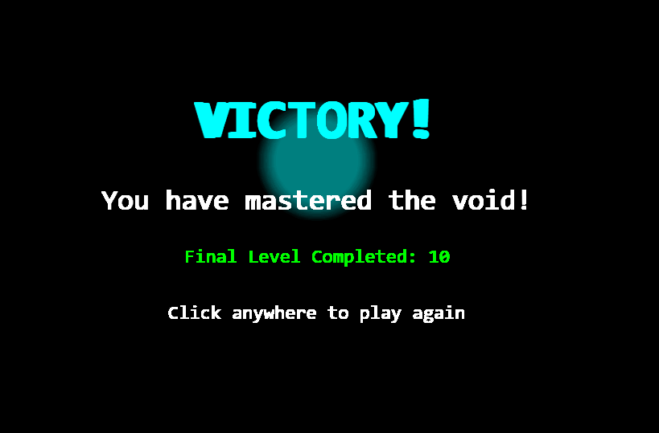
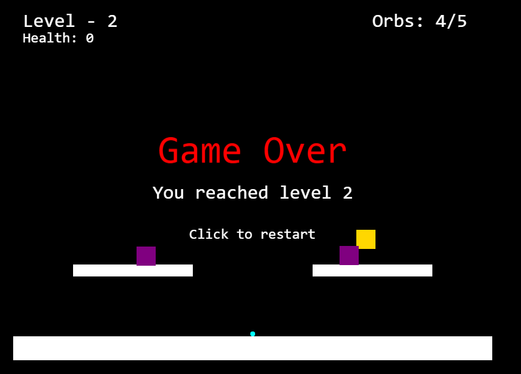

# 🎮 Shadowlight: Escape from the Void

<div align="center">



### A Thrilling 2D Platformer Adventure in the Void

[](https://phaser.io/phaser3)
[](https://developer.mozilla.org/en-US/docs/Web/JavaScript)
[](https://developer.mozilla.org/en-US/docs/Web/Guide/HTML/HTML5)

🎯 **Collect Orbs** | 🏃 **Dodge Enemies** | 🌟 **Master the Void** | 🎲 **10 Unique Levels**

[Screenshots](#screenshots) • [Play Now](#play-the-game) • [Features](#game-features) • [Controls](#controls) • [Installation](#installation)

</div>

## About The Game

Navigate through the darkness as a glowing entity, collecting mysterious orbs while avoiding dangerous enemies. Master the art of timing and precision as you progress through 10 challenging levels, each with unique layouts and increasing difficulty. Can you escape the void?

## Screenshots

### Victory Screen


### Gameplay


### Game Over Screen


## Play the Game

Open `index.html` in a modern web browser to play the game.

## Game Features

- 10 unique levels with increasing difficulty
- Collect orbs to unlock portals
- Dodge enemies and manage your health
- Special admin mode for practice (Press 'R')
- Responsive controls and smooth gameplay
- Beautiful victory screen with special effects

## Controls

- **Arrow Keys**: Move and jump
- **P**: Pause game
- **R**: Toggle admin mode (infinite health)

## How to Play

1. Use arrow keys to move and jump
2. Collect all orbs in each level
3. Avoid or time your movements around enemies
4. Portal appears after collecting all orbs
5. Touch the portal to proceed to next level
6. Complete all 10 levels to win!

## Technical Details

- Built with Phaser 3.70.0
- Pure JavaScript implementation
- No additional dependencies required
- Responsive design

## Installation

1. Clone the repository:
```bash
git clone https://github.com/soham-tiger/Shadowlight-Escape-from-the-Void.git
```

2. Open `index.html` in a web browser

No additional setup or installation required!

## Development

The game is built using:
- HTML5
- Phaser 3 Game Framework
- JavaScript

## Features

- Smooth player movement and jumping mechanics
- Enemy AI with patrol patterns
- Health system with visual feedback
- Level progression system
- Collectible orbs
- Portal mechanics
- Admin mode for practice
- Pause functionality
- Victory celebration screen
